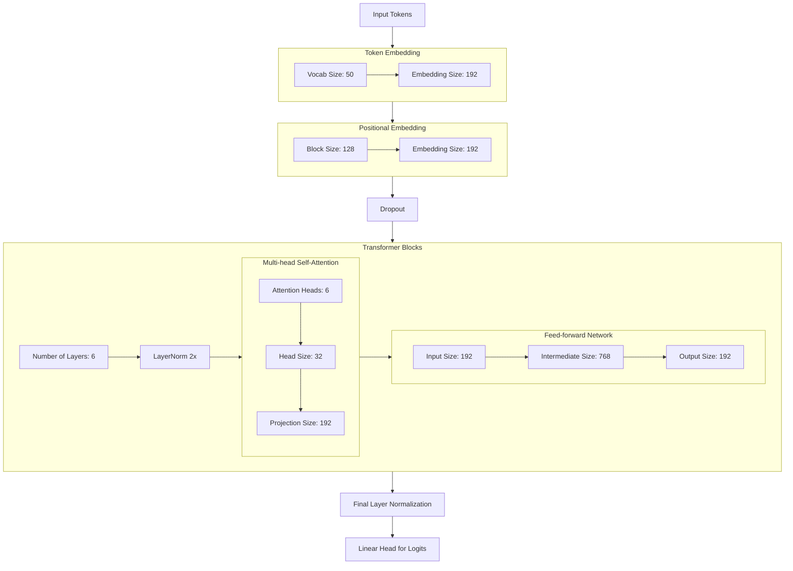

```mermaid
flowchart TD
    A[Input Tokens] --> B[Token Embedding]
    B --> C[Positional Embedding]
    C --> D[Dropout]
    D --> E{Transformer Blocks}
    E --> F[Final Layer Normalization]
    F --> G[Linear Head for Logits]

    subgraph B [Token Embedding]
        B1[Vocab Size: 50] --> B2[Embedding Size: 192]
    end

    subgraph C [Positional Embedding]
        C1[Block Size: 128] --> C2[Embedding Size: 192]
    end

    subgraph E [Transformer Blocks]
        E1[Number of Layers: 6] --> E2[LayerNorm 2x]
        E2 --> E3[Multi-head Self-Attention]
        E3 --> E4[Feed-forward Network]
    end

    subgraph E3 [Multi-head Self-Attention]
        E3a[Attention Heads: 6] --> E3b[Head Size: 32]
        E3b --> E3c[Projection Size: 192]
    end

    subgraph E4 [Feed-forward Network]
        E4a[Input Size: 192] --> E4b[Intermediate Size: 768]
        E4b --> E4c[Output Size: 192]
    end
```
