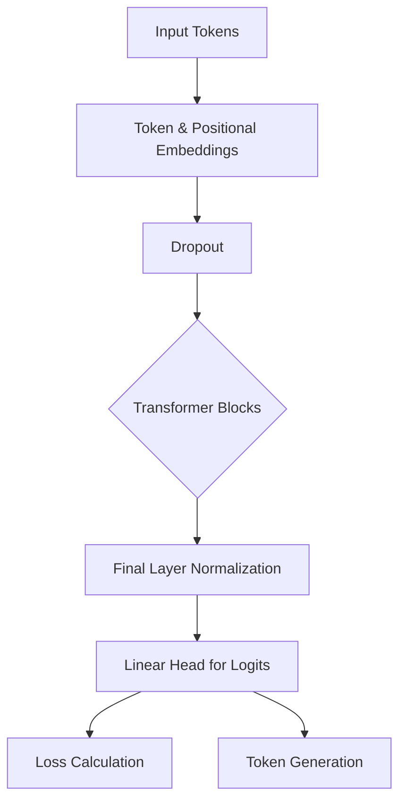

```mermaid
flowchart TD
    A[Input Tokens] --> B[Token & Positional Embeddings]
    B --> C[Dropout]
    C --> D{Transformer Blocks}
    D --> E[Final Layer Normalization]
    E --> F[Linear Head for Logits]
    F --> G[Loss Calculation]
    F --> H[Token Generation]
```
